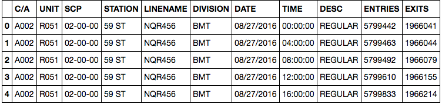
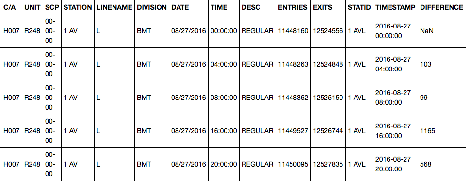
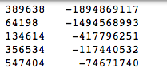

For Project One at Metis we were tasked with using the MTA Turnstile data to 
make conclusions about how to optimize canvassing for e-mails in New York. 
The most important part of this project for me was its lesson in data cleaning.
The turnstile data was insidiously error-ridden and for this reason I will be 
dedicating most of this post to just the cleaning process.  

# 1. Gathering the Data

Naturally, the first step is to gather the data you are going to use.
This can be found at the [MTA Website](http://web.mta.info/developers/turnstile.html).
For this example I will be cleaning the data from the weeks of [September 03, 
2016](http://web.mta.info/developers/data/nyct/turnstile/turnstile_160903.txt), 
[September 10, 2016](http://web.mta.info/developers/data/nyct/turnstile/turnstile_160910.txt), and 
[September 17, 2016](http://web.mta.info/developers/data/nyct/turnstile/turnstile_160917.txt).  
In order to decipher the data and what each column's name means, you'll need
the [field description.](http://web.mta.info/developers/resources/nyct/turnstile/ts_Field_Description.txt) 
To download these files, I used the curl command from the command line.
`curl http://web.mta.info/developers/data/nyct/turnstile/turnstile_160903.txt > 9_03_2016_turnstile.csv`  
After putting each week's data into a csv, I booted up Python.  

# 2. Importing and Cleaning. 

After downloading all of the data into csv files, I loaded them into a pandas
dataframe.

```
import pandas as pd

sep_03_2016_df = pd.read_csv('9_3_2016_turnstiles.csv')
sep_10_2016_df = pd.read_csv('9_10_2016_turnstiles.csv')
sep_17_2016_df = pd.read_csv('9_17_2016_turnstiles.csv')


df = pd.concat([sep_03_2016_df,sep_10_2016_df,sep_17_2016_df],ignore_index=True)
```
Let's take a look at what the data looks like.

`df.head()`  


The first thing to note, for the purpose of being able to uniquely indentify 
a station, is that the field STATION can represent more than one station, 
and therefore you also have to take into account the linename.  
With this in mind, I created a new field called STATID (for station ID), which 
serves to uniquely identify a station.  
`df['STATID'] = df.STATION + df.LINENAME`  

The next step is to create a new field called TIMESTAMP which joins the DATE 
and TIME fields into one field. This will be helpful for sorting.  
`df['TIMESTAMP'] = pd.to_datetime((df.DATE + ' ' + df.TIME), format='%m/%d/%Y %H:%M:%S')`  

Now that I have a way to identify each station, I sort the data by STATID, UNIT,
 SCP and TIMESTAMP to make sure that no data is out of order.

`df = df.sort_values(['STATID', 'UNIT','SCP', 'TIMESTAMP'])`  

As of now, the data has been sorted and given a few new fields to help with the
 processing. What I'm interested in is the amount of entries per time interval.
 Looking at the [field description](http://web.mta.info/developers/resources/nyct/turnstile/ts_Field_Description.txt) for ENTRIES, I can see that it records
 a cumulative count of entries at each turnstile. Therefore if I want to find 
out the number of entries in each interval, I have to take the difference of 
the count at the end and start time. I do this using pd.diff() and I store the 
result in a new field called DIFFERENCE. N.B. the way I have set it up, the 
value of DIFFERENCE for each time is the total entries that occurred between 
that time and the previous time.   

`df['DIFFERENCE']=df.groupby(['STATID','UNIT','SCP'],as_index=False)['ENTRIES'].transform(pd.Series.diff)['ENTRIES']`   

Let's have another look at the dataframe.

`df.head()`  


You'll notice that the first entry for the new field is NaN. This is a because 
there were no entries before it to subtract, so pandas gave it a value of Not a
 Number.  

# 3. Getting Rid of Outliers  

The final bit of data cleaning I did before getting into analysis was getting 
rid of the outliers and modifying some of the entries so that they would not 
skew the statistics measured on the dataset.  

### Ridiculous numbers vs. Reasonable numbers  

To find out the extreme values, I sorted the dataframe by the values 
in the DIFFERENCE field and looked at the smallest values.  
```
sorted_df = df.sort_values('DIFFERENCE')
sorted_df['DIFFERENCE'].head()
```


These numbers give a sense of the scale of some of the entries. Clearly, even 
if considering the absolue values of these numbers, it is physically impossible 
for so many entries to have occurred in an interval of four hours.  
Using this reasoning I quickly weeded out most of the ridiculous numbers from 
the data. I was left with the smallest value being -4993. Given that some of 
the counters seemed to be counting in reverse, I decided to investigate this 
entry closer to see if the counts added up
